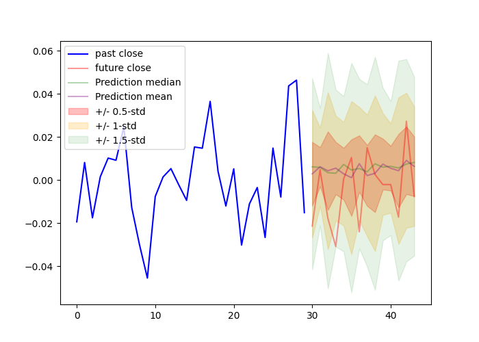
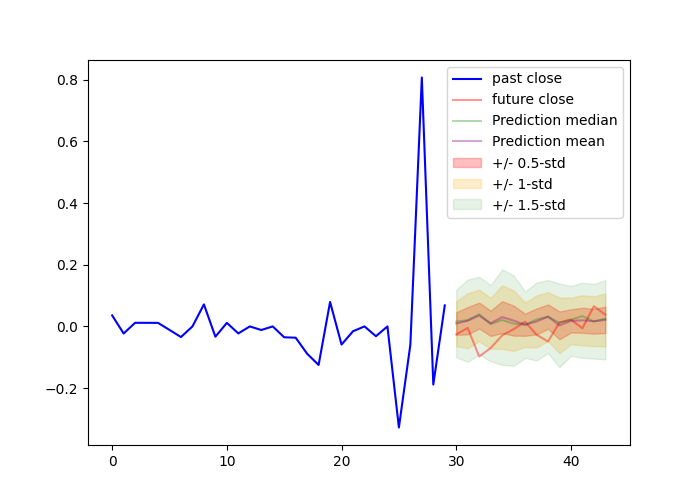
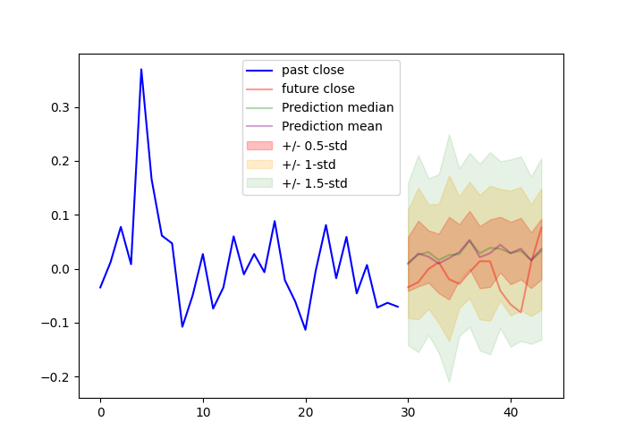
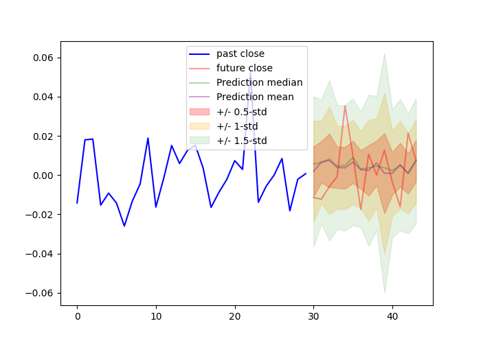
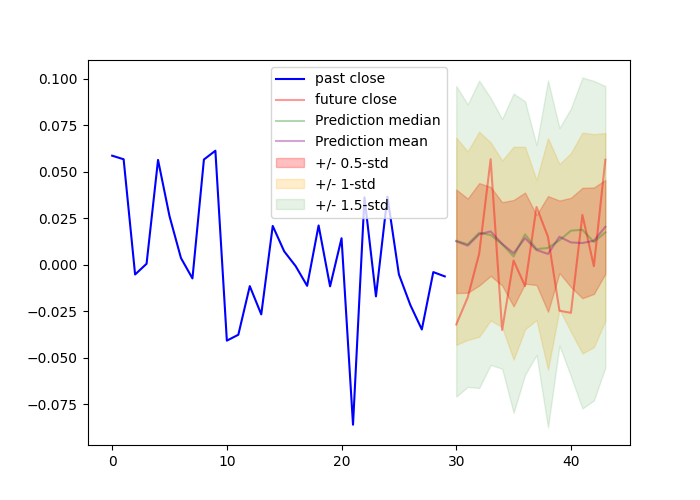

# ProbabalisticForecasting
---

An implementation of the Lag-Llama model with a GluonTS dataloader integration. My notes about probabilistic decoder only transformers can be found in the Probabilistic_Transformers_Notes PDF.

### Downloading the data

**yf : yahoo_fin (PyPI)**

Default tickers: yf.tickers_dow() + yf.tickers_sp500() + yf.tickers_nasdaq()

```sh
    python download_data.py
```

### Model Training

The environment to run the main.py script can be set up using the provided docker image. To build the docker image run:
```sh
    docker build --platform linux/amd64 -t prob_forecasting .
```

Once built, access the image terminal by running:
```sh
    docker run --gpus=all --rm -it prob_forecasting sh
    docker run --gpus=1 --rm -it prob_forecasting sh
```


To run the script with default parameters use:
```sh
    python main.py
    python3 main.py
```

To run the script with a subset (length=30) of the data. This functionality is mainly used for quick testing:
```sh
    python main.py --debug True
    python3 main.py --debug True
```

To see a full list of command line arguments use:
```sh
    python main.py --help
    python3 main.py --help
```

### Model

<p style="align-center">See "Probabalistic_Transformers_Notes.pdf for model architecture.</p>

### TODO

    - [ ] Model trainer class
    - [ ] Model analytics from experiment.json
    - [ ] Finish training V1.0 (No mean reversion spread (A,B) feature) 
    - [ ] Train V2.0 (mean reversion feature between tickers (A,B))
    - [ ] Inference package

### Preliminary results

<p style="align-center">Model output is a learned student-t distribution representing the daily returns for a stock ID'ed by ticker: t. Test data retrieved after every epoch, each band represents a 0.5 std tolerance increase. Prediction length: T+14days. Context Window: 92 days.</p>

#### **Epoch 0**

| | | |
|:-------------------------:|:-------------------------:|:-------------------------:|
|  |  ||
|  |  ||
|  |  ||

Training restarted after variance past future information to the train set.

#### **Epoch 4**

| | | |
|:-------------------------:|:-------------------------:|:-------------------------:|
|  |  ||
|  |  ||
|  |  ||

